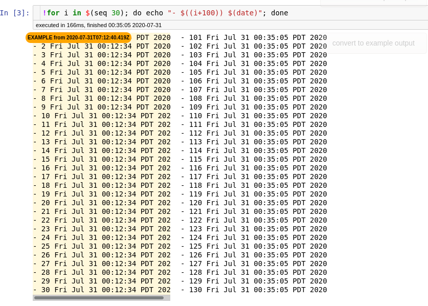

Preserve existing cell output as a permanent exemplar
==============

If you use notebooks as reproducible documentation, sometimes you may want to replay a notebook interactively, but want to keep the existing output as a reference.

This extension allows you to take existing output from a cell and save it as an "Exemplar output", which gets attached to an `ExemplifiedOutput` entry in the metadata.

When a cell has existing `ExemplifiedOutput`, it gets rendered to the side of the cell's latest output:

The Exemplar output expands on mouse over to full width.

Internals
---------

This extension's logic largely takes from the [Execute Time](https://jupyter-contrib-nbextensions.readthedocs.io/en/latest/nbextensions/execute_time/readme.html) extension
